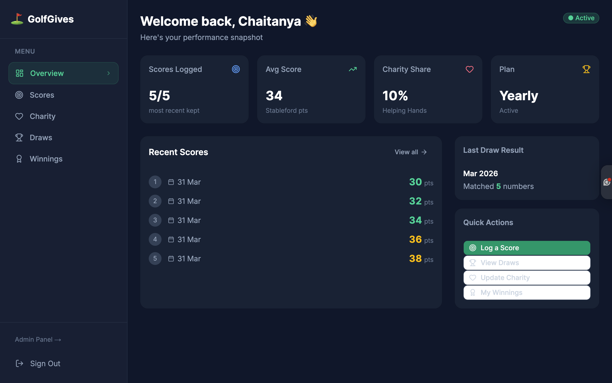
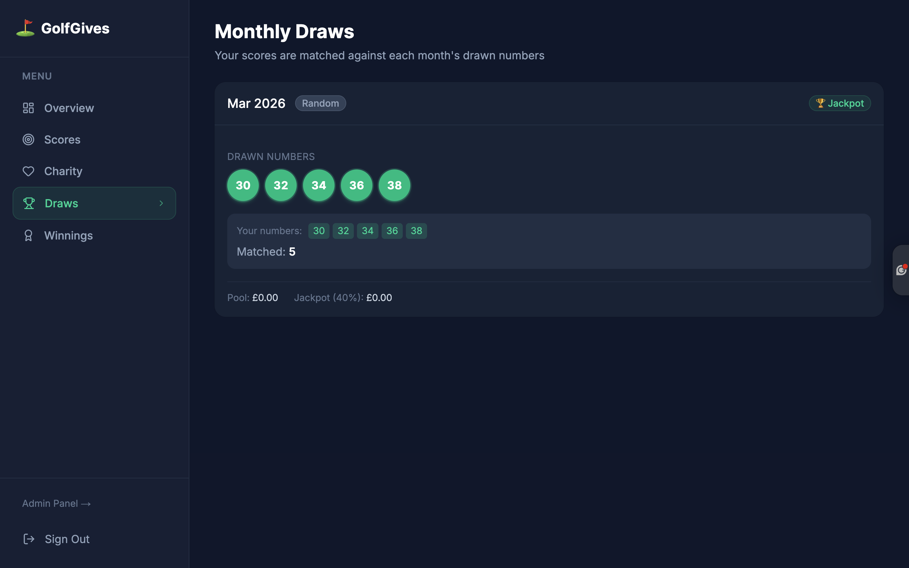
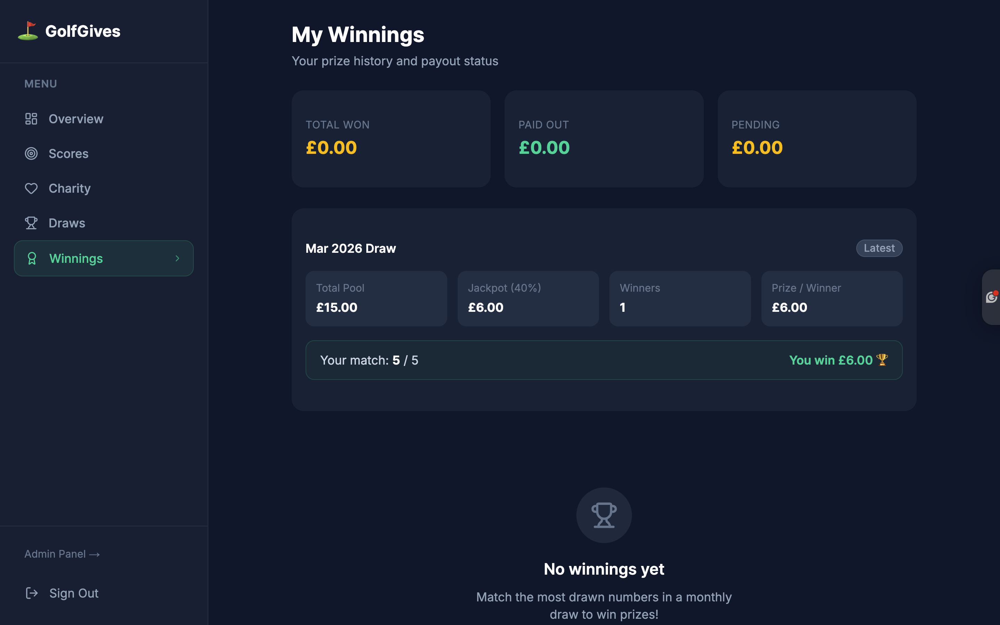

# ⛳ GolfGives — Golf Charity Subscription Platform

> A full-stack charity lottery platform where golfers subscribe monthly, log Stableford scores, and compete in automated prize draws — with a portion of every payment going directly to a chosen charity.

🔗 **Live Demo:** [golf-charity-platform-ashen.vercel.app](https://golf-charity-platform-ashen.vercel.app)

---

## 📌 Problem & Solution

Golf clubs and charity organisations lack a digital platform to run transparent, automated prize draws funded by member subscriptions. GolfGives solves this by combining Stripe-powered recurring payments, Supabase-backed draw logic, and a real-time winnings dashboard — all in one platform.

---

## ✨ Features

- 🎯 **Monthly Draw System** — Admin publishes draws with randomly or algorithmically generated numbers each month
- 🔢 **Number Matching Logic** — User's last 5 Stableford scores are matched against drawn numbers; highest match count wins
- 💳 **Stripe Subscription Payments** — Monthly (£15) and yearly (£150) plans via Stripe Checkout
- 🔁 **Webhook Automation** — Stripe webhooks automatically activate/deactivate subscriptions on payment events
- 💚 **Charity Contribution Selection** — Users choose a charity and set a contribution percentage (min 10%)
- 🏆 **Winnings Calculation & Distribution** — Prize pool split: 40% jackpot, tier 2 (35%), tier 3 (25%); jackpot rolls over if no winner
- 🔐 **Authentication** — Supabase Auth with email/password, JWT sessions, Row Level Security, and auto-profile creation

---

## 🛠 Tech Stack

| Layer | Technology |
|---|---|
| Frontend & Backend | Next.js 14 (App Router, Server Components) |
| Database & Auth | Supabase (PostgreSQL + RLS + Auth) |
| Payments | Stripe (Checkout, Subscriptions, Webhooks) |
| Styling | Tailwind CSS v4 + shadcn/ui |
| Deployment | Vercel |

---

## 🧠 System Flow

```
User Subscribes (Stripe Checkout)
        ↓
Webhook fires → profile.subscription_status = 'active'
        ↓
User logs Stableford scores (stored, max 5 kept)
        ↓
Admin publishes monthly draw (drawn_numbers generated)
        ↓
Server compares each user's scores vs drawn_numbers
        ↓
Highest match count = winner(s)
        ↓
Prize pool calculated → split by tier → prize_won recorded
        ↓
Admin marks payment as paid → user sees payout in dashboard
```

---

## 📸 Screenshots

| Dashboard | Monthly Draws | Winnings |
|---|---|---|
|  |  |  |

> _Add screenshots to a `/screenshots` folder at the project root._

---

## 🧑‍💻 Run Locally

```bash
git clone https://github.com/your-username/golf-charity-platform.git
cd golf-charity-platform
npm install
cp .env.local.example .env.local   # Fill in your keys
npm run dev
```

Open [http://localhost:3000](http://localhost:3000)

To test Stripe webhooks locally:
```bash
stripe listen --forward-to localhost:3000/api/stripe/webhook
```

---

## 🔐 Environment Variables

```env
NEXT_PUBLIC_SUPABASE_URL=
NEXT_PUBLIC_SUPABASE_ANON_KEY=
SUPABASE_SERVICE_ROLE_KEY=

NEXT_PUBLIC_STRIPE_PUBLISHABLE_KEY=
STRIPE_SECRET_KEY=
STRIPE_WEBHOOK_SECRET=
STRIPE_MONTHLY_PRICE_ID=
STRIPE_YEARLY_PRICE_ID=

NEXT_PUBLIC_APP_URL=
```

---

## 🚀 Deployment

1. Push to GitHub and import into [Vercel](https://vercel.com)
2. Add all environment variables in Vercel project settings
3. Register your production webhook endpoint in **Stripe Dashboard → Developers → Webhooks**:
   - URL: `https://your-domain.vercel.app/api/stripe/webhook`
   - Events: `checkout.session.completed`, `invoice.payment_succeeded`, `invoice.payment_failed`

---

## 📈 Future Improvements

- 📧 Email notifications for draw results and payouts
- 🤖 Automated monthly draw scheduling (cron job)
- 🏅 Public leaderboard with score rankings
- 📱 Mobile app (React Native)
- 📊 Admin analytics dashboard with charity impact metrics

---

## 🧾 Resume Description

> Built a full-stack charity subscription platform using Next.js 14, Supabase, and Stripe — featuring automated prize draws, webhook-driven subscription management, and real-time winnings tracking, deployed on Vercel.
